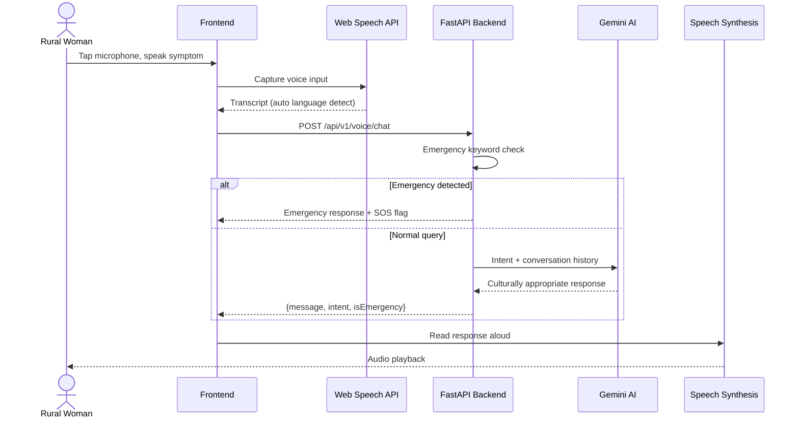
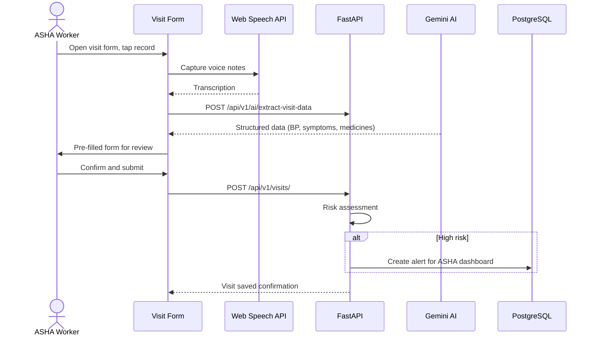

# ASHA AI — Voice-First Healthcare for Rural India

[](https://opensource.org/licenses/MIT)
[](https://reactjs.org/)
[](https://www.typescriptlang.org/)
[](https://fastapi.tiangolo.com/)
[](https://www.postgresql.org/)

> **ASHA AI** (Adaptive Support for Health & Awareness) is a voice-first, AI-powered maternal and reproductive health platform built for rural Indian women, ASHA workers, and NGO partners. It works on low-end devices, supports 11+ Indian languages, and is designed for intermittent connectivity.

# View Live Demo: https://aasha-ai-37xu.vercel.app/
---

## Table of Contents

- [Overview](#overview)
- [The Problem](#the-problem)
- [Our Solution](#our-solution)
- [User Roles](#user-roles)
- [Features](#features)
- [User Flows](#user-flows)
- [Tech Stack](#tech-stack)
- [Architecture](#architecture)
- [Project Structure](#project-structure)
- [API Reference](#api-reference)
- [Getting Started](#getting-started)
- [Environment Variables](#environment-variables)
- [Multilingual Support](#multilingual-support)
- [Security & Privacy](#security--privacy)
- [Contributors](#contributors)
- [License](#license)

---

## Overview

ASHA AI bridges the last mile in rural healthcare by combining:

- **Voice-first interaction** — no reading or typing required
- **AI health guidance** — culturally sensitive, WHO-aligned responses via Gemini
- **Digital tools for ASHA workers** — visit logging, risk alerts, QR health cards
- **Government scheme access** — discover and enroll in health benefits
- **Offline-first design** — sync when connectivity returns

### Mission

Provide dignified, private, and accessible healthcare guidance to underserved rural communities while empowering ASHA (Accredited Social Health Activist) workers with intelligent digital tools.

---

## The Problem

### Meet Radha

Radha is 19, pregnant, and anemic. She lives in a village in Bihar where:

- She cannot read medical pamphlets or text-heavy health apps
- She is too shy to discuss reproductive health with family or male doctors
- Her ASHA worker visits once a month and manages 1,000+ villagers

> *"I have questions, but I don't know who to ask..."*

### By the Numbers

| Challenge | Scale |
|-----------|-------|
| Rural women lacking accessible health guidance | ~300 million |
| ASHA worker coverage | 1 worker per ~1,000 people |
| Users unable to install native apps | ~95% |
| Maternal mortality risk from delayed care | High |

---

## Our Solution

| Pillar | What it does |
|--------|--------------|
| **Voice-First** | Speak in Hindi, Tamil, Gujarati, and 8+ more languages — no typing |
| **ASHA Didi AI** | Warm, non-judgmental health companion powered by Gemini |
| **Whisper Privacy** | Anonymous usage, local storage, auto-delete on shared phones |
| **ASHA Empowerment** | Voice visit logging, risk alerts, digital health cards, village analytics |
| **Offline-First** | Queue actions offline; sync automatically when back online |

---

## User Roles

The app serves three distinct user types, each with a dedicated dashboard and workflow.

| Role | Who they are | Primary goal |
|------|--------------|--------------|
| **Beneficiary** | Rural women & adolescent girls (ages 10–45) | Get private health guidance, track cycles, access schemes |
| **ASHA Worker** | Community health activists | Manage patients, log visits, respond to alerts |
| **Partner** | NGOs & government scheme administrators | Create and manage health benefit schemes |

### Role Selection Flow

```
Landing Page → Role Selection → Login/Register → Role-specific Dashboard
```

Routes:

| Role | Dashboard URL |
|------|---------------|
| Beneficiary | `/beneficiary` |
| ASHA Worker | `/asha` |
| Partner | `/partner` |

---

## Features

### For Beneficiaries (Rural Women & Girls)

| Feature | Description | Route |
|---------|-------------|-------|
| **Voice Assistant (ASHA Didi)** | Speak symptoms, get AI guidance with audio playback | Dashboard (floating) |
| **SOS / Red Zone Button** | One-tap emergency alert to linked ASHA worker | Dashboard |
| **Period & Cycle Tracker** | Voice-based cycle logging, fertile window, irregularity detection | `/beneficiary/tracker` |
| **Nutrition Planner** | Iron-rich meal plans using local foods (jaggery, greens, chana) | `/beneficiary/nutrition` |
| **Health Education Library** | Bite-sized articles on pregnancy, puberty, hygiene, danger signs | `/beneficiary/education` |
| **Government Schemes** | Browse and enroll in health benefit programs | `/beneficiary/schemes` |
| **Digital Health Card** | QR-coded health profile for ASHA visits | `/beneficiary/card` |
| **IFA Reminders** | Iron-Folic Acid tablet tracking on dashboard | Dashboard |
| **Child & Vaccination Tracking** | Track children's vaccination schedules | Dashboard |

### For ASHA Workers

| Feature | Description | Route |
|---------|-------------|-------|
| **Patient Dashboard** | High-risk patients, today's visits, vaccine due list | `/asha` |
| **Voice Visit Logging** | Speak visit notes → AI extracts vitals, symptoms, medicines | `/asha/visit` |
| **Visit Scheduler** | Schedule, complete, and cancel patient visits | `/asha/scheduler` |
| **QR Scanner** | Scan beneficiary health cards to open profiles | `/asha/scan` |
| **Patient List & Profiles** | Full beneficiary history, health logs, risk level | `/asha/patients`, `/asha/patient/:id` |
| **Alert Management** | Real-time SOS and high-risk alerts with resolution | `/asha/alerts` |
| **Scheme Management** | Enroll beneficiaries in government schemes | `/asha/schemes` |
| **Vaccination Tracking** | Due/overdue vaccine alerts per child | Dashboard |

### For Partners (NGOs)

| Feature | Description | Route |
|---------|-------------|-------|
| **Partner Dashboard** | Scheme performance overview and analytics | `/partner` |
| **Scheme Management** | Create, edit, and publish health benefit schemes | `/partner/schemes` |
| **Campaign Builder** | Custom microsite config with forms and tasks | `/partner/schemes/create` |
| **Enrollment Analytics** | Track beneficiary enrollments per scheme | `/partner/schemes/:id` |

### Cross-Cutting Features

- **11+ language support** with auto language detection
- **Web Speech API** for STT/TTS (browser-native)
- **OpenAI Whisper** fallback for noisy environments (backend)
- **Offline sync queue** with optimistic UI updates
- **JWT authentication** with role-based access control
- **Network status indicator** and toast notifications
- **Dark/light theme** toggle
- **Responsive design** for 320px–1920px screens

---

## User Flows

### 1. Beneficiary — Voice Health Query



**Example interaction:**

```
User (Hindi):  "मुझे पेट में बहुत दर्द है"
ASHA Didi:     "आपको पेट में दर्द कब से है? क्या यह तेज़ है?"
               [Audio playback in Hindi]
```

### 2. Beneficiary — Period Tracking

```
Open Cycle Tracker → Speak or enter last period date
        ↓
System calculates cycle phase, fertile window, next period
        ↓
Dashboard shows status card (e.g., "Day 14 — Fertile Window")
        ↓
Data saved locally; synced to backend when online
```

### 3. ASHA Worker — Voice Visit Logging



### 4. ASHA Worker — QR Health Card Scan

```
Open QR Scanner → Scan beneficiary's digital health card
        ↓
Patient profile loads (vitals, risk level, visit history)
        ↓
Log visit / view alerts / schedule follow-up
```

### 5. Emergency SOS Flow

```
Beneficiary taps SOS button on dashboard
        ↓
POST /api/v1/alerts/sos/{beneficiary_id}
        ↓
Alert created with status "open"
        ↓
ASHA worker dashboard polls alerts every 30s
        ↓
ASHA worker acknowledges and visits patient
```

### 6. Offline Sync Flow

```
User performs action while offline
        ↓
Action stored in local sync queue (Zustand store)
        ↓
Network reconnects → "Back online! Syncing data..." toast
        ↓
Sync queue processed sequentially against API
        ↓
Success → remove from queue; Failure → retry later
```

### 7. Partner — Scheme Creation

```
Partner Dashboard → Create Scheme
        ↓
Define benefits, eligibility, target audience
        ↓
Configure campaign microsite (theme, forms, tasks)
        ↓
Publish scheme → visible to beneficiaries and ASHA workers
        ↓
Track enrollments and analytics
```

---

## Tech Stack

### Frontend

| Technology | Version | Purpose |
|------------|---------|---------|
| React | 19 | UI framework |
| TypeScript | 5.8 | Type safety |
| Vite | 6 | Build tool & dev server |
| React Router | 7 | Client-side routing |
| Zustand | 5 | State management |
| Tailwind CSS | 3.4 | Styling |
| Framer Motion | 12 | Animations |
| Axios | 1.9 | HTTP client with JWT interceptors |
| Recharts | 3 | Health data charts |
| date-fns | 4 | Date handling |
| html5-qrcode | 2 | QR scanning |
| react-qr-code | 2 | QR generation |

### Backend

| Technology | Version | Purpose |
|------------|---------|---------|
| Python | 3.12+ | Runtime |
| FastAPI | 0.109 | Async REST API |
| SQLAlchemy | 2.0 | Async ORM |
| Alembic | 1.13 | Database migrations |
| PostgreSQL | 14+ | Primary database |
| asyncpg | 0.29 | Async PostgreSQL driver |
| python-jose | 3.3 | JWT tokens |
| bcrypt | 4.1 | Password hashing |
| Pydantic | 2.5 | Request/response validation |
| OpenAI Whisper | — | Server-side speech-to-text |
| Uvicorn | 0.27 | ASGI server |

### AI & Voice

| Service | Role |
|---------|------|
| **Gemini API** | Chat responses, medical extraction, risk assessment, nutrition plans |
| **Web Speech API** | Browser-native STT/TTS (primary) |
| **OpenAI Whisper** | Enhanced STT for noisy audio (backend `/voice/transcribe`) |

### Infrastructure

| Component | Options |
|-----------|---------|
| Database | PostgreSQL (local or Neon DB cloud) |
| Frontend hosting | Netlify / Vercel / static CDN |
| Backend hosting | Render / Railway / Docker |
| API docs | Auto-generated Swagger at `/docs` |

---

## Architecture

```
┌─────────────────────────────────────────────────────────────┐
│                     CLIENT LAYER                            │
│  ┌──────────────┐  ┌──────────────┐  ┌──────────────┐       │
│  │  React + Vite│  │ Voice Input  │  │ Offline Sync │       │
│  │  (TypeScript)│  │ (Web Speech) │  │   (Zustand)  │       │
│  └──────────────┘  └──────────────┘  └──────────────┘       │
└─────────────────────────────────────────────────────────────┘
                            ↕ HTTPS / REST
┌─────────────────────────────────────────────────────────────┐
│                   APPLICATION LAYER                         │
│  ┌──────────────┐  ┌──────────────┐  ┌──────────────┐       │
│  │   FastAPI    │  │  JWT Auth    │  │     CORS     │       │
│  │   Routers    │  │  Middleware  │  │  Middleware  │       │
│  └──────────────┘  └──────────────┘  └──────────────┘       │
└─────────────────────────────────────────────────────────────┘
                            ↕ SQLAlchemy ORM
┌─────────────────────────────────────────────────────────────┐
│                      DATA LAYER                             │
│  ┌──────────────┐  ┌──────────────┐  ┌──────────────┐       │
│  │  PostgreSQL  │  │   Alembic    │  │  Gemini AI   │       │
│  │              │  │  Migrations  │  │  (External)  │       │
│  └──────────────┘  └──────────────┘  └──────────────┘       │
└─────────────────────────────────────────────────────────────┘
```

### Authentication Flow

```
1. POST /api/v1/auth/login → JWT access token (30 min) + refresh token (7 days)
2. All requests include: Authorization: Bearer <access_token>
3. Token expired → POST /api/v1/auth/refresh → new access token
4. Role injected into request: beneficiary | asha_worker | partner | admin
```

---

## Project Structure

```
asha-ai-techx/
├── frontend/                    # React + Vite frontend
│   ├── src/
│   │   ├── components/
│   │   │   ├── ui/              # Button, GlassCard, VoiceInput, etc.
│   │   │   ├── beneficiary/     # CalendarWidget, HealthCharts, etc.
│   │   │   ├── partner/         # CampaignBuilder, PhonePreview
│   │   │   └── layout/          # RoleLayout, Header, Sidebar
│   │   ├── pages/
│   │   │   ├── Landing.tsx
│   │   │   ├── auth/            # Login, RoleSelection
│   │   │   ├── beneficiary/     # Dashboard, Tracker, Nutrition, etc.
│   │   │   ├── asha/            # Dashboard, VisitForm, QRScanner, etc.
│   │   │   └── partner/         # Dashboard, SchemesList, CreateScheme
│   │   ├── services/            # API service layer
│   │   ├── hooks/               # useVoiceRecorder, useWhisperSTT, etc.
│   │   ├── store/               # Zustand global state
│   │   ├── data/                # Health content, vaccines, translations
│   │   └── lib/                 # API client, auth, AI prompts
│   ├── .env.example
│   └── package.json
│
├── backend/                     # FastAPI backend
│   ├── app/
│   │   ├── main.py              # App entry point
│   │   ├── core/                # Config, database, security
│   │   └── apps/
│   │       ├── users/           # Auth (register, login, JWT)
│   │       ├── beneficiaries/   # Beneficiary profiles
│   │       ├── daily_logs/      # Daily health logs
│   │       ├── health_logs/     # Detailed health records
│   │       ├── alerts/          # SOS & risk alerts
│   │       ├── children/        # Child health & vaccinations
│   │       ├── schemes/         # Government schemes
│   │       ├── enrollments/     # Scheme enrollments
│   │       ├── visits/          # ASHA visit scheduling
│   │       ├── ai/              # Gemini integration
│   │       └── voice/           # Whisper STT & voice chat
│   ├── alembic/                 # Database migrations
│   ├── requirements.txt
│   └── .env.example
│
├── design.md                    # System design document
├── requirements.md              # Technical requirements
└── README.md
```

---

## API Reference

Base URL: `http://localhost:8000/api/v1`

Interactive docs: `http://localhost:8000/docs`

| Module | Prefix | Key Endpoints |
|--------|--------|---------------|
| **Auth** | `/auth` | `POST /register`, `POST /login`, `POST /refresh`, `GET /me` |
| **Beneficiaries** | `/beneficiaries` | `GET /`, `POST /`, `GET /my-profile`, `PUT /{id}` |
| **Daily Logs** | `/daily-logs` | `GET /`, `POST /`, `GET /today` |
| **Health Logs** | `/health-logs` | `GET /`, `POST /`, `GET /{id}` |
| **Alerts** | `/alerts` | `GET /active`, `POST /sos/{id}`, `POST /{id}/resolve` |
| **Children** | `/children` | `GET /`, `POST /`, `POST /{id}/vaccinations/{vaccine_id}` |
| **Schemes** | `/schemes` | `GET /active`, `POST /`, `GET /{id}/stats` |
| **Enrollments** | `/enrollments` | `GET /my-enrollments`, `POST /` |
| **Visits** | `/visits` | `GET /today`, `POST /`, `POST /{id}/complete` |
| **AI** | `/ai` | `POST /generate`, `POST /analyze-voice`, `POST /nutrition-plan`, `POST /extract-visit-data` |
| **Voice** | `/voice` | `POST /transcribe`, `POST /chat`, `GET /history` |

---

## Getting Started

### Prerequisites

| Tool | Version |
|------|---------|
| Node.js | 18+ |
| Python | 3.12+ |
| PostgreSQL | 14+ |
| npm or yarn | Latest |
| Chrome or Edge | Recommended (best Web Speech API support) |

### 1. Clone the Repository

```bash
git clone https://github.com/yourusername/asha-ai.git
cd asha-ai-techx-main
```

### 2. Database Setup

**macOS (Homebrew):**

```bash
brew install postgresql@16
brew services start postgresql@16
createdb asha_ai
```

**Linux:**

```bash
sudo apt install postgresql postgresql-contrib
sudo systemctl start postgresql
sudo -u postgres createdb asha_ai
```

### 3. Backend Setup

```bash
cd backend

# Create virtual environment (Python 3.12+ required)
python3.12 -m venv venv
source venv/bin/activate        # Windows: venv\Scripts\activate

# Install dependencies
pip install -r requirements.txt

# Configure environment
cp .env.example .env
# Edit .env with your database URL and secrets (see below)

# Run migrations
alembic upgrade head

# Start the server
uvicorn app.main:app --reload --port 8000
```

Backend runs at: **http://localhost:8000**
API docs at: **http://localhost:8000/docs**

### 4. Frontend Setup

```bash
cd frontend

# Install dependencies
npm install

# Configure environment
cp .env.example .env

# Start dev server
npm run dev
```

Frontend runs at: **http://localhost:5173**

### 5. Production Build

```bash
# Frontend
cd frontend
npm run build
npm run preview

# Backend
cd backend
uvicorn app.main:app --host 0.0.0.0 --port 8000
```

---

## Environment Variables

### Frontend (`frontend/.env`)

```env
# Backend API URL
VITE_API_URL=http://localhost:8000/api/v1

# App name
VITE_APP_NAME="ASHA AI"

# Gemini AI endpoint (hosted)
VITE_GEMINI_API_URL=https://test-gemini-941q.onrender.com
```

### Backend (`backend/.env`)

```env
# Database
DATABASE_URL=postgresql+asyncpg://<user>@localhost:5432/asha_ai
DATABASE_URL_SYNC=postgresql://<user>@localhost:5432/asha_ai

# JWT (use a strong secret in production)
JWT_SECRET=your-super-secret-key-at-least-32-chars
JWT_ALGORITHM=HS256
ACCESS_TOKEN_EXPIRE_MINUTES=30
REFRESH_TOKEN_EXPIRE_DAYS=7

# Gemini API
GEMINI_API_URL=https://test-gemini-941q.onrender.com/generate

# App
DEBUG=true
CORS_ORIGINS=http://localhost:3000,http://localhost:5173
```

> For cloud deployment, use [Neon DB](https://neon.tech) for PostgreSQL and set `DATABASE_URL` with your Neon connection string.

---

## Multilingual Support

ASHA AI supports **11 Indian languages** plus English:

| Language | Code | STT | TTS |
|----------|------|-----|-----|
| Hindi | `hi` | Yes | Yes |
| Gujarati | `gu` | Yes | Yes |
| Kannada | `kn` | Yes | Yes |
| Tamil | `ta` | Yes | Yes |
| Telugu | `te` | Yes | Yes |
| Malayalam | `ml` | Yes | Yes |
| Marathi | `mr` | Yes | Yes |
| Bengali | `bn` | Yes | Yes |
| Punjabi | `pa` | Yes | Yes |
| Bhojpuri | `bh` | Yes (Hindi fallback) | Yes |
| English | `en` | Yes | Yes |

**Auto language detection:** The system detects script/characters in speech input and responds in the same language. No manual language selection required during conversation.

**UI translations:** English, Hindi, Bhojpuri, Punjabi, and Marathi are supported in the interface via the language toggle.

---

## Security & Privacy

| Layer | Implementation |
|-------|----------------|
| **Authentication** | JWT access + refresh tokens, bcrypt password hashing |
| **Authorization** | Role-based access control (beneficiary, asha_worker, partner, admin) |
| **Transport** | HTTPS/TLS in production; SSL for PostgreSQL |
| **Input validation** | Pydantic schemas on all API endpoints |
| **SQL injection** | Parameterized queries via SQLAlchemy ORM |
| **CORS** | Whitelisted origins in production |
| **Privacy mode** | Local storage for sensitive data; optional anonymous usage |
| **Emergency detection** | Keyword-based red-flag alerts (Hindi + English) |

### Emergency Keywords Monitored

```
Hindi:   खून, बहुत दर्द, बेहोश, चक्कर, बुखार, मदद
English: bleeding, severe pain, unconscious, dizzy, fever, help, emergency
Signs:   baby not moving, convulsion, water broke, heavy bleeding, can't breathe
```

---

## Contributors

Built with care by:

| Name | GitHub |
|------|--------|
| Prakhar Singh | [@masoomprakhar](https://github.com/masoomprakhar) |
| Prateek Srivastava | [@prateek-workspace](https://github.com/prateek-workspace) |
| Lakshya Barnwal | [@lakshya-baranwal](https://github.com/lakshya-baranwal) |
| Prakhar Dixit| [@Prakhar54dixit](https://github.com/Prakhar54dixit) |

### Contributing

1. Fork the repository
2. Create a feature branch (`git checkout -b feature/your-feature`)
3. Commit your changes (`git commit -m 'Add your feature'`)
4. Push to the branch (`git push origin feature/your-feature`)
5. Open a Pull Request

---

## License

This project is licensed under the **MIT License**.

---

**Built for Social Good** | **Designed for Impact**

*If you believe in accessible healthcare for all, star this repo.*
